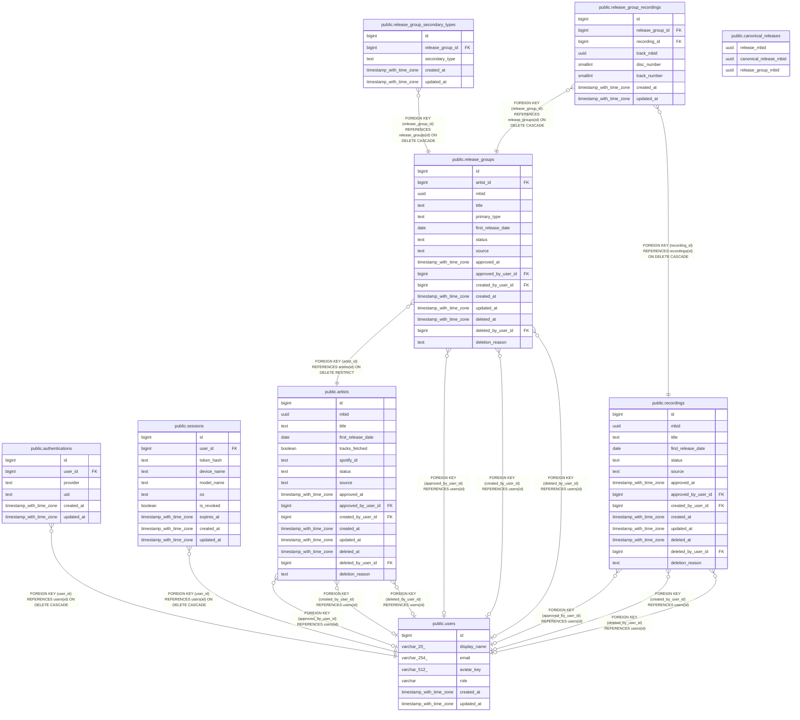

# livejuke

## Tables

| Name | Columns | Comment | Type |
| ---- | ------- | ------- | ---- |
| [public.users](public.users.md) | 7 |  | BASE TABLE |
| [public.authentications](public.authentications.md) | 6 |  | BASE TABLE |
| [public.sessions](public.sessions.md) | 10 |  | BASE TABLE |
| [public.artists](public.artists.md) | 16 |  | BASE TABLE |
| [public.canonical_releases](public.canonical_releases.md) | 3 |  | BASE TABLE |
| [public.release_groups](public.release_groups.md) | 16 |  | BASE TABLE |
| [public.recordings](public.recordings.md) | 14 |  | BASE TABLE |
| [public.release_group_secondary_types](public.release_group_secondary_types.md) | 5 |  | BASE TABLE |
| [public.release_group_recordings](public.release_group_recordings.md) | 8 |  | BASE TABLE |

## Stored procedures and functions

| Name | ReturnType | Arguments | Type |
| ---- | ------- | ------- | ---- |
| public.update_updated_at | trigger |  | FUNCTION |

## Relations

---

> Generated by [tbls](https://github.com/k1LoW/tbls)
