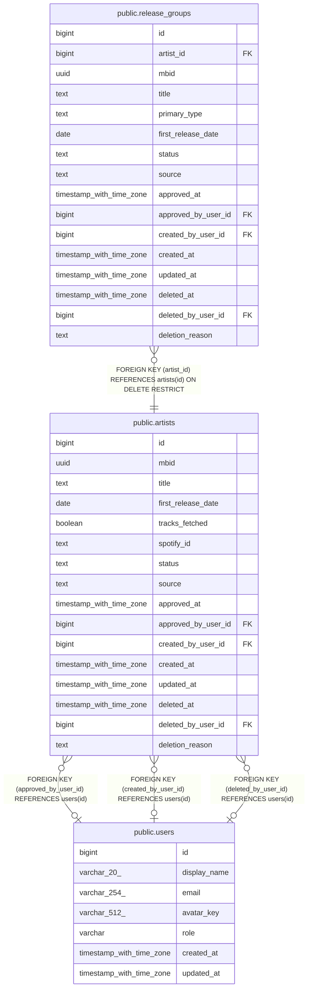

# public.artists

## Columns

| Name | Type | Default | Nullable | Children | Parents | Comment |
| ---- | ---- | ------- | -------- | -------- | ------- | ------- |
| id | bigint |  | false | [public.release_groups](public.release_groups.md) |  |  |
| mbid | uuid |  | true |  |  |  |
| title | text |  | false |  |  |  |
| first_release_date | date |  | true |  |  |  |
| tracks_fetched | boolean | false | false |  |  |  |
| spotify_id | text |  | true |  |  |  |
| status | text | 'pending'::text | false |  |  |  |
| source | text |  | false |  |  |  |
| approved_at | timestamp with time zone |  | true |  |  |  |
| approved_by_user_id | bigint |  | true |  | [public.users](public.users.md) |  |
| created_by_user_id | bigint |  | true |  | [public.users](public.users.md) |  |
| created_at | timestamp with time zone | now() | false |  |  |  |
| updated_at | timestamp with time zone | now() | false |  |  |  |
| deleted_at | timestamp with time zone |  | true |  |  |  |
| deleted_by_user_id | bigint |  | true |  | [public.users](public.users.md) |  |
| deletion_reason | text |  | true |  |  |  |

## Constraints

| Name | Type | Definition |
| ---- | ---- | ---------- |
| artists_source_check | CHECK | CHECK ((source = ANY (ARRAY['musicbrainz'::text, 'manual'::text]))) |
| artists_status_check | CHECK | CHECK ((status = ANY (ARRAY['pending'::text, 'approved'::text]))) |
| deleted_consistency | CHECK | CHECK ((((deleted_at IS NULL) AND (deleted_by_user_id IS NULL)) OR ((deleted_at IS NOT NULL) AND (deleted_by_user_id IS NOT NULL)))) |
| mbid_source_consistency | CHECK | CHECK ((((source = 'musicbrainz'::text) AND (mbid IS NOT NULL)) OR ((source = 'manual'::text) AND (mbid IS NULL)))) |
| status_approved_consistency | CHECK | CHECK ((((status = 'pending'::text) AND (approved_at IS NULL) AND (approved_by_user_id IS NULL)) OR ((status = 'approved'::text) AND (approved_at IS NOT NULL) AND (approved_by_user_id IS NOT NULL)))) |
| artists_approved_by_user_id_fkey | FOREIGN KEY | FOREIGN KEY (approved_by_user_id) REFERENCES users(id) |
| artists_created_by_user_id_fkey | FOREIGN KEY | FOREIGN KEY (created_by_user_id) REFERENCES users(id) |
| artists_deleted_by_user_id_fkey | FOREIGN KEY | FOREIGN KEY (deleted_by_user_id) REFERENCES users(id) |
| artists_pkey | PRIMARY KEY | PRIMARY KEY (id) |
| artists_mbid_key | UNIQUE | UNIQUE (mbid) |
| artists_spotify_id_key | UNIQUE | UNIQUE (spotify_id) |

## Indexes

| Name | Definition |
| ---- | ---------- |
| artists_pkey | CREATE UNIQUE INDEX artists_pkey ON public.artists USING btree (id) |
| artists_mbid_key | CREATE UNIQUE INDEX artists_mbid_key ON public.artists USING btree (mbid) |
| artists_spotify_id_key | CREATE UNIQUE INDEX artists_spotify_id_key ON public.artists USING btree (spotify_id) |

## Triggers

| Name | Definition |
| ---- | ---------- |
| set_updated_at | CREATE TRIGGER set_updated_at BEFORE UPDATE ON public.artists FOR EACH ROW EXECUTE FUNCTION update_updated_at() |

## Relations

---

> Generated by [tbls](https://github.com/k1LoW/tbls)
