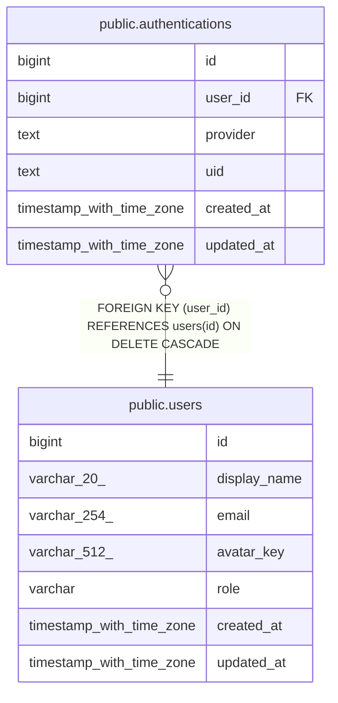

# public.authentications

## Columns

| Name | Type | Default | Nullable | Children | Parents | Comment |
| ---- | ---- | ------- | -------- | -------- | ------- | ------- |
| id | bigint |  | false |  |  |  |
| user_id | bigint |  | false |  | [public.users](public.users.md) |  |
| provider | text |  | false |  |  |  |
| uid | text |  | false |  |  |  |
| created_at | timestamp with time zone | now() | false |  |  |  |
| updated_at | timestamp with time zone | now() | false |  |  |  |

## Constraints

| Name | Type | Definition |
| ---- | ---- | ---------- |
| authentications_provider_check | CHECK | CHECK ((provider = ANY (ARRAY['email'::text, 'google'::text]))) |
| authentications_user_id_fkey | FOREIGN KEY | FOREIGN KEY (user_id) REFERENCES users(id) ON DELETE CASCADE |
| authentications_pkey | PRIMARY KEY | PRIMARY KEY (id) |
| authentications_provider_uid_key | UNIQUE | UNIQUE (provider, uid) |
| authentications_user_id_provider_key | UNIQUE | UNIQUE (user_id, provider) |

## Indexes

| Name | Definition |
| ---- | ---------- |
| authentications_pkey | CREATE UNIQUE INDEX authentications_pkey ON public.authentications USING btree (id) |
| authentications_provider_uid_key | CREATE UNIQUE INDEX authentications_provider_uid_key ON public.authentications USING btree (provider, uid) |
| authentications_user_id_provider_key | CREATE UNIQUE INDEX authentications_user_id_provider_key ON public.authentications USING btree (user_id, provider) |

## Triggers

| Name | Definition |
| ---- | ---------- |
| set_updated_at | CREATE TRIGGER set_updated_at BEFORE UPDATE ON public.authentications FOR EACH ROW EXECUTE FUNCTION update_updated_at() |

## Relations

---

> Generated by [tbls](https://github.com/k1LoW/tbls)
