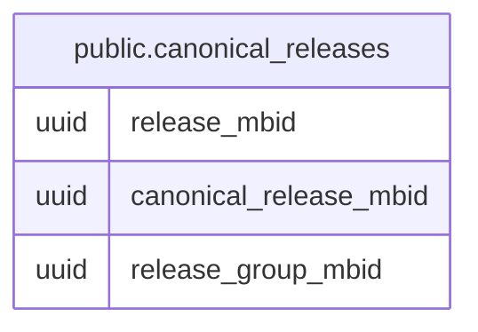

# public.canonical_releases

## Columns

| Name | Type | Default | Nullable | Children | Parents | Comment |
| ---- | ---- | ------- | -------- | -------- | ------- | ------- |
| release_mbid | uuid |  | false |  |  |  |
| canonical_release_mbid | uuid |  | false |  |  |  |
| release_group_mbid | uuid |  | false |  |  |  |

## Indexes

| Name | Definition |
| ---- | ---------- |
| idx_canonical_releases_release_group_mbid | CREATE INDEX idx_canonical_releases_release_group_mbid ON public.canonical_releases USING btree (release_group_mbid) |

## Relations

---

> Generated by [tbls](https://github.com/k1LoW/tbls)
