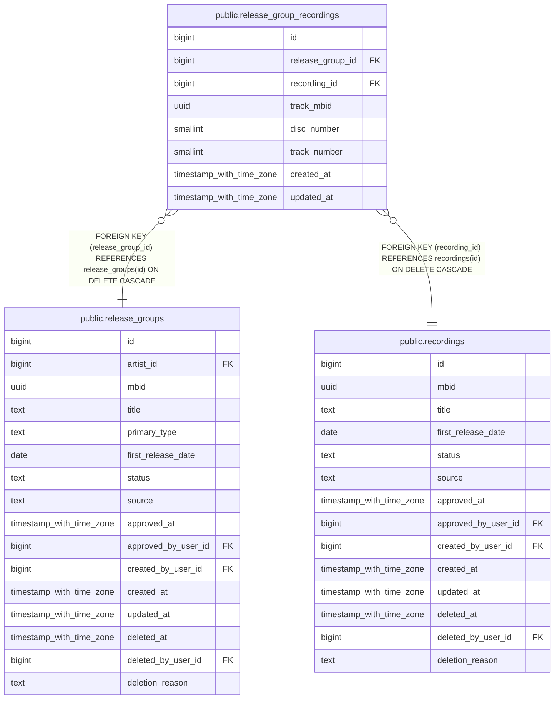

# public.release_group_recordings

## Columns

| Name | Type | Default | Nullable | Children | Parents | Comment |
| ---- | ---- | ------- | -------- | -------- | ------- | ------- |
| id | bigint |  | false |  |  |  |
| release_group_id | bigint |  | false |  | [public.release_groups](public.release_groups.md) |  |
| recording_id | bigint |  | false |  | [public.recordings](public.recordings.md) |  |
| track_mbid | uuid |  | true |  |  |  |
| disc_number | smallint |  | false |  |  |  |
| track_number | smallint |  | false |  |  |  |
| created_at | timestamp with time zone | now() | false |  |  |  |
| updated_at | timestamp with time zone | now() | false |  |  |  |

## Constraints

| Name | Type | Definition |
| ---- | ---- | ---------- |
| release_group_recordings_disc_number_check | CHECK | CHECK ((disc_number > 0)) |
| release_group_recordings_track_number_check | CHECK | CHECK ((track_number > 0)) |
| release_group_recordings_release_group_id_fkey | FOREIGN KEY | FOREIGN KEY (release_group_id) REFERENCES release_groups(id) ON DELETE CASCADE |
| release_group_recordings_recording_id_fkey | FOREIGN KEY | FOREIGN KEY (recording_id) REFERENCES recordings(id) ON DELETE CASCADE |
| release_group_recordings_pkey | PRIMARY KEY | PRIMARY KEY (id) |
| release_group_recordings_track_mbid_key | UNIQUE | UNIQUE (track_mbid) |
| release_group_recordings_release_group_id_recording_id_key | UNIQUE | UNIQUE (release_group_id, recording_id) |
| release_group_recordings_release_group_id_disc_number_track_key | UNIQUE | UNIQUE (release_group_id, disc_number, track_number) |

## Indexes

| Name | Definition |
| ---- | ---------- |
| release_group_recordings_pkey | CREATE UNIQUE INDEX release_group_recordings_pkey ON public.release_group_recordings USING btree (id) |
| release_group_recordings_track_mbid_key | CREATE UNIQUE INDEX release_group_recordings_track_mbid_key ON public.release_group_recordings USING btree (track_mbid) |
| release_group_recordings_release_group_id_recording_id_key | CREATE UNIQUE INDEX release_group_recordings_release_group_id_recording_id_key ON public.release_group_recordings USING btree (release_group_id, recording_id) |
| release_group_recordings_release_group_id_disc_number_track_key | CREATE UNIQUE INDEX release_group_recordings_release_group_id_disc_number_track_key ON public.release_group_recordings USING btree (release_group_id, disc_number, track_number) |

## Triggers

| Name | Definition |
| ---- | ---------- |
| set_updated_at | CREATE TRIGGER set_updated_at BEFORE UPDATE ON public.release_group_recordings FOR EACH ROW EXECUTE FUNCTION update_updated_at() |

## Relations

---

> Generated by [tbls](https://github.com/k1LoW/tbls)
