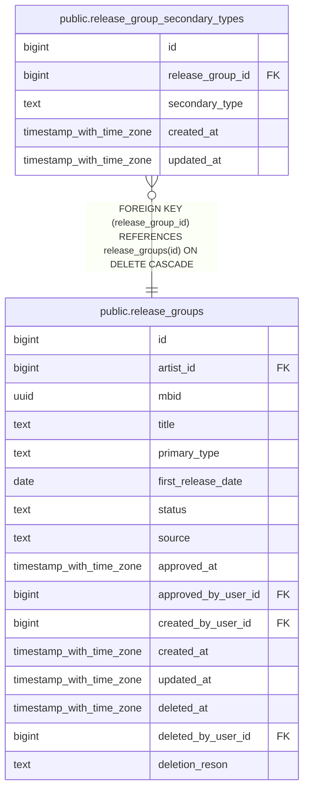

# public.release_group_secondary_types

## Columns

| Name | Type | Default | Nullable | Children | Parents | Comment |
| ---- | ---- | ------- | -------- | -------- | ------- | ------- |
| id | bigint |  | false |  |  |  |
| release_group_id | bigint |  | false |  | [public.release_groups](public.release_groups.md) |  |
| secondary_type | text |  | false |  |  |  |
| created_at | timestamp with time zone | now() | false |  |  |  |
| updated_at | timestamp with time zone | now() | false |  |  |  |

## Constraints

| Name | Type | Definition |
| ---- | ---- | ---------- |
| release_group_secondary_types_secondary_type_check | CHECK | CHECK ((secondary_type = ANY (ARRAY['compilation'::text, 'soundtrack'::text, 'spokenword'::text, 'interview'::text, 'audiobook'::text, 'audio_drama'::text, 'live'::text, 'remix'::text, 'dj_mix'::text, 'mixtape_street'::text, 'demo'::text, 'field_recording'::text]))) |
| release_group_secondary_types_release_group_id_fkey | FOREIGN KEY | FOREIGN KEY (release_group_id) REFERENCES release_groups(id) ON DELETE CASCADE |
| release_group_secondary_types_pkey | PRIMARY KEY | PRIMARY KEY (id) |
| release_group_secondary_types_release_group_id_secondary_ty_key | UNIQUE | UNIQUE (release_group_id, secondary_type) |

## Indexes

| Name | Definition |
| ---- | ---------- |
| release_group_secondary_types_pkey | CREATE UNIQUE INDEX release_group_secondary_types_pkey ON public.release_group_secondary_types USING btree (id) |
| release_group_secondary_types_release_group_id_secondary_ty_key | CREATE UNIQUE INDEX release_group_secondary_types_release_group_id_secondary_ty_key ON public.release_group_secondary_types USING btree (release_group_id, secondary_type) |

## Triggers

| Name | Definition |
| ---- | ---------- |
| set_updated_at | CREATE TRIGGER set_updated_at BEFORE UPDATE ON public.release_group_secondary_types FOR EACH ROW EXECUTE FUNCTION update_updated_at() |

## Relations

---

> Generated by [tbls](https://github.com/k1LoW/tbls)
