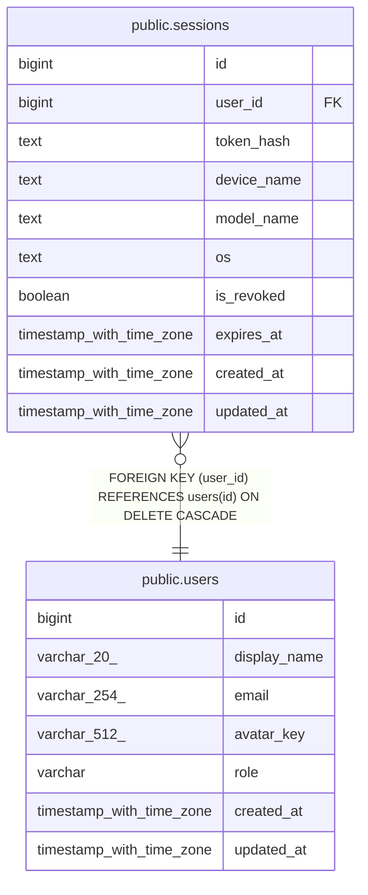

# public.sessions

## Columns

| Name | Type | Default | Nullable | Children | Parents | Comment |
| ---- | ---- | ------- | -------- | -------- | ------- | ------- |
| id | bigint |  | false |  |  |  |
| user_id | bigint |  | false |  | [public.users](public.users.md) |  |
| token_hash | text |  | false |  |  |  |
| device_name | text |  | true |  |  |  |
| model_name | text |  | true |  |  |  |
| os | text |  | false |  |  |  |
| is_revoked | boolean | false | false |  |  |  |
| expires_at | timestamp with time zone |  | false |  |  |  |
| created_at | timestamp with time zone | now() | false |  |  |  |
| updated_at | timestamp with time zone | now() | false |  |  |  |

## Constraints

| Name | Type | Definition |
| ---- | ---- | ---------- |
| sessions_user_id_fkey | FOREIGN KEY | FOREIGN KEY (user_id) REFERENCES users(id) ON DELETE CASCADE |
| sessions_pkey | PRIMARY KEY | PRIMARY KEY (id) |
| sessions_token_hash_key | UNIQUE | UNIQUE (token_hash) |

## Indexes

| Name | Definition |
| ---- | ---------- |
| sessions_pkey | CREATE UNIQUE INDEX sessions_pkey ON public.sessions USING btree (id) |
| sessions_token_hash_key | CREATE UNIQUE INDEX sessions_token_hash_key ON public.sessions USING btree (token_hash) |
| idx_sessions_user_id | CREATE INDEX idx_sessions_user_id ON public.sessions USING btree (user_id) |

## Triggers

| Name | Definition |
| ---- | ---------- |
| set_updated_at | CREATE TRIGGER set_updated_at BEFORE UPDATE ON public.sessions FOR EACH ROW EXECUTE FUNCTION update_updated_at() |

## Relations

---

> Generated by [tbls](https://github.com/k1LoW/tbls)
