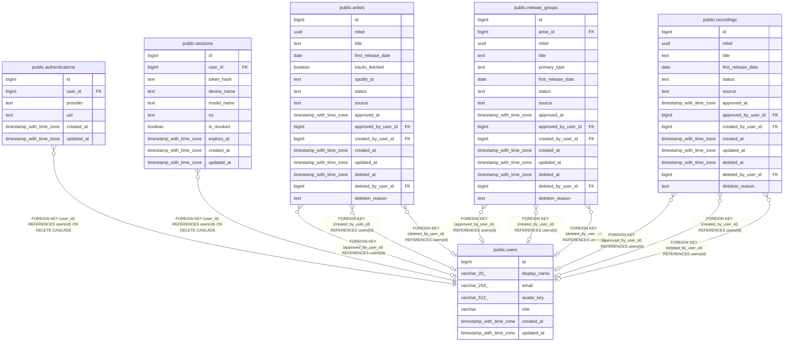

# public.users

## Columns

| Name | Type | Default | Nullable | Children | Parents | Comment |
| ---- | ---- | ------- | -------- | -------- | ------- | ------- |
| id | bigint |  | false | [public.authentications](public.authentications.md) [public.sessions](public.sessions.md) [public.artists](public.artists.md) [public.release_groups](public.release_groups.md) [public.recordings](public.recordings.md) |  |  |
| display_name | varchar(20) | 'ゲスト'::character varying | false |  |  |  |
| email | varchar(254) |  | false |  |  |  |
| avatar_key | varchar(512) | NULL::character varying | true |  |  |  |
| role | varchar | 'user'::character varying | false |  |  |  |
| created_at | timestamp with time zone | now() | false |  |  |  |
| updated_at | timestamp with time zone | now() | false |  |  |  |

## Constraints

| Name | Type | Definition |
| ---- | ---- | ---------- |
| users_role_check | CHECK | CHECK (((role)::text = ANY ((ARRAY['user'::character varying, 'admin'::character varying])::text[]))) |
| users_pkey | PRIMARY KEY | PRIMARY KEY (id) |
| users_email_key | UNIQUE | UNIQUE (email) |

## Indexes

| Name | Definition |
| ---- | ---------- |
| users_pkey | CREATE UNIQUE INDEX users_pkey ON public.users USING btree (id) |
| users_email_key | CREATE UNIQUE INDEX users_email_key ON public.users USING btree (email) |

## Triggers

| Name | Definition |
| ---- | ---------- |
| set_updated_at | CREATE TRIGGER set_updated_at BEFORE UPDATE ON public.users FOR EACH ROW EXECUTE FUNCTION update_updated_at() |

## Relations

---

> Generated by [tbls](https://github.com/k1LoW/tbls)
